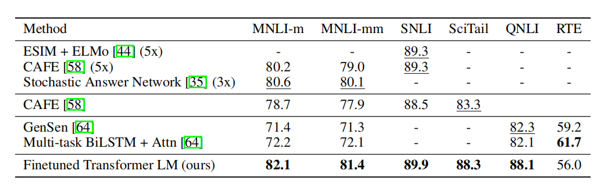
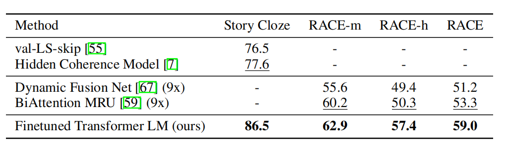
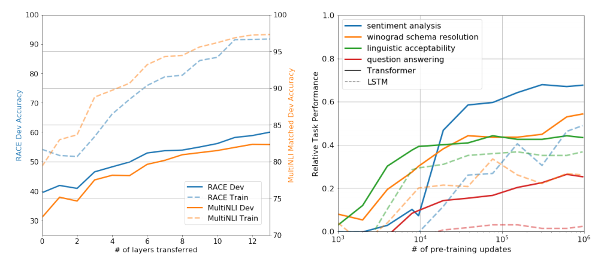
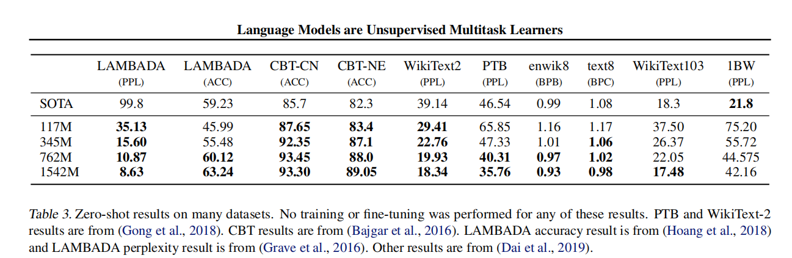
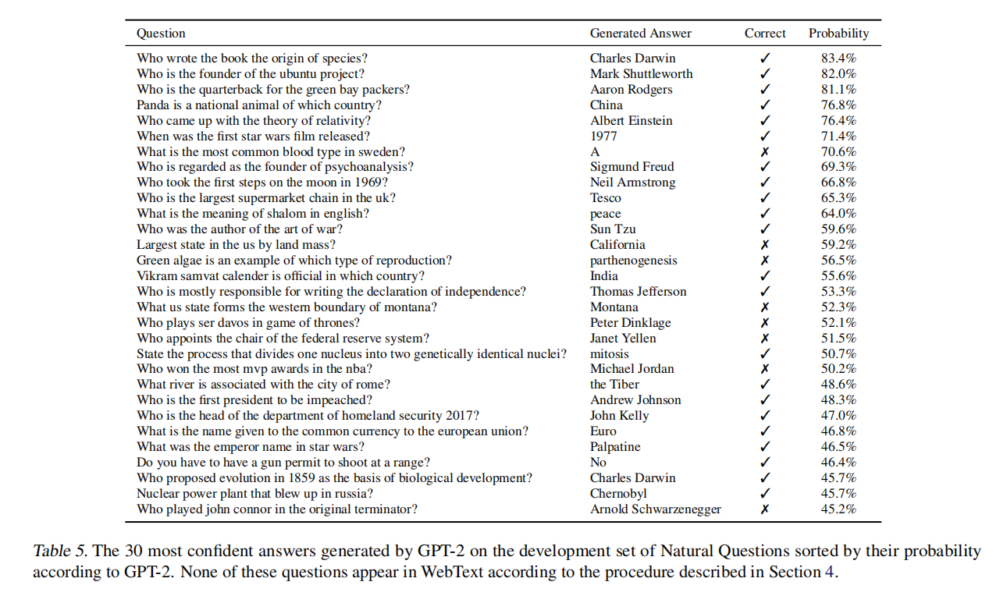
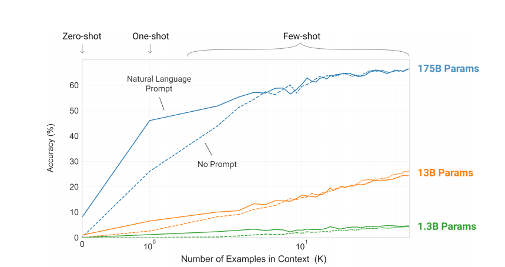
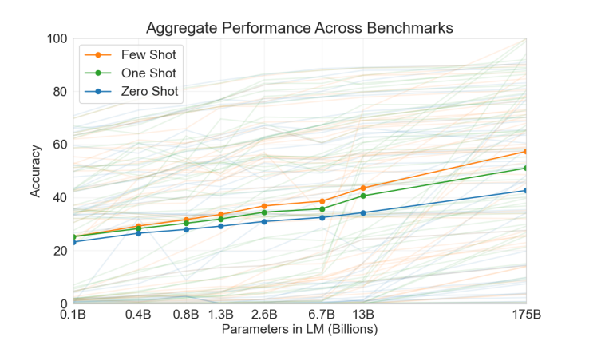
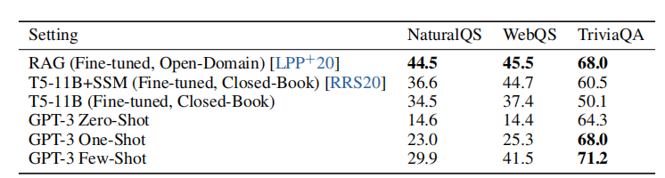
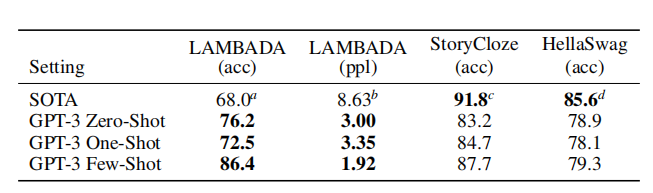

# 论文选题
我本次的报告选取的是GPT系列的论文，接下来是涉及讨论的论文列表
- **Improving Language Understanding by Generative Pre-Training**
- **Language Models are Unsupervised Multitask Learners**
- **Language Models are Few-Shot Learners**

# 研究背景
## 一、GPT (2018)
### 研究背景
1. ​**核心问题**：
   - 传统NLP模型依赖大量**任务特定标注数据**，在低资源领域（医疗、小语种）表现受限
   - 词嵌入方法（Word2Vec/GloVe）仅传递**词级信息**，无法捕捉上下文语义
   - BiLSTM等架构需为每个任务定制模型，泛化能力差

2. ​**突破性方案**：
   - 提出**两阶段框架**：
     - ​**无监督预训练**：在BooksCorpus（7,000本书）训练117M参数Transformer语言模型
     - ​**有监督微调**：用少量标注数据适配下游任务，仅调整顶层参数（<0.1%参数量）
   - ​**任务输入改造**：
     - 文本蕴含：拼接前提+假设+分隔符
     - 相似度：双向序列拼接
     - QA：文档+问题+答案拼接

## 二、GPT-2 (2019)
### 研究背景
1. ​新挑战：
    - ​**GPT仍需任务微调​**，与人类"看示例即学习"能力差距大
    - ​**传统方法​**难以处理开放域任务（如创意写作）
2. 架构创新：
    - ​**构建WebText数据集​**
    - ​**字节级​BPE分词​**
    - ​**模型规模升级​**

        | 模型       | 参数量 | 训练数据量 | 层数 |
        |------------|--------|------------|------|
        | GPT-2 Base | 117M   | 40GB       | 12   |
        | GPT-2 Large| 1.5B   | 同左       | 48   |

3. 零样本突破：
    在​**未训练任务​**上实现竞争性表现：
    - 法语翻译：零样本BLEU 11.5 → 少样本BLEU 40.0
    - 新闻生成：人类辨别准确率仅52%（近随机猜测）

## 三、GPT-3 (2020)
### 研究背景
1. 本质矛盾：
    - GPT-2零样本性能仍落后监督模型（如CoQA问答差35分）
    - 模型需动态适应新任务（如即时学习新词"Gigamuru"）
2. 规模革命：
    - 千亿级参数：
        | 模型       | 参数量 | 训练数据量 | 训练能耗     |
        |------------|--------|------------|--------------|
        | GPT-3      | 175B   | 570GB      | 190万度电    |
        | GPT-2      | 1.5B   | 40GB       | 0.3万度电    |
    - 混合数据集：
        - 60% CommonCrawl（过滤后质量提升）
        - 22% WebText2 + 8% Books1/2 + 3% Wikipedia 
    - 上下文学习机制

## 发展脉络对比
| 维度         | GPT (2018)           | GPT-2 (2019)          | GPT-3 (2020)              |
|--------------|----------------------|-----------------------|---------------------------|
| ​**核心创新** | 预训练-微调范式      | 零样本任务迁移        | 上下文学习机制            |
| ​**参数量**   | 117M                 | 1.5B (↑12.8x)         | 175B (↑116x)              |
| ​**训练数据** | BooksCorpus (4.5GB)  | WebText (40GB)        | 混合数据集 (570GB)        |
| ​**关键突破** | 9项任务SOTA          | 人类级文本生成        | 少样本超越监督模型        |
| ​**计算效率** | 1 GPU-day/epoch      | 256 TPU-v3 days       | 3,640 PetaFLOP-day        |
| ​**局限**     | 需微调才能适配任务   | 零样本性能不稳定      | 偏见放大    |

# 研究动机
​NLP发展背景与范式演进

##  ​三篇论文的研究动机路线解析
- 1.GPT-1（2018）：生成式预训练的开创者
    - 背景痛点：
        - 传统监督学习依赖标注数据（如GLUE任务）
        - RNN/LSTM存在长程依赖和并行训练缺陷
    - 核心动机："Leverage unsupervised pre-training to improve supervised task performance" （验证通用语言模型能否通过生成式预训练获得可迁移表示）
    - 技术衔接：
        - 基于Transformer解码器（解决RNN瓶颈）
        - 提出两阶段框架（预训练 + 微调）
- GPT-2（2019）：零样本能力的探索
    - 新挑战：
        - BERT兴起带来双向架构优势
        - 微调范式仍需任务特定数据
    - 核心动机：
        "Can language models perform NLP tasks without task-specific training?" （质疑微调的必要性，探索原生多任务能力）
    - 技术演进：
        - 扩大模型规模（1.5B参数）
        - 提出零样本推理框架：
        ```
            [Task Prompt] + [Input] → [Model Output]
        ```
- ​3. GPT-3（2020）：少样本学习的革命
    - 深层问题：
        - 零样本表现仍弱于监督模型
        - 人类仅需少量示例即可学习新任务
    - 核心动机：
        "Achieve human-like task adaptation via in-context learning" (用提示工程（Prompt Engineering）替代参数更新)

    - 技术突破：
        - 规模定律验证：175B参数（100×GPT-2）
        - 提出上下文学习范式：
        ```
            English: "Hello"  
            French: "Bonjour"
            English: "Thank you" → French: ?
        ```
    ```mermaid  
        graph TB
        GPT1 -->|证明生成式预训练| BERT[双向架构兴起]
        GPT2 -->|推动零样本研究| Prompt[提示工程学科]
        GPT3 -->|催生| LLM[大模型时代]
    ```

# 解决方案

1. GPT-1：统一架构的预训练微调范式
核心架构：
- Transformer Decoder：12层，768隐藏层维度，12个注意力头
- 预训练目标：标准语言建模（从左到右的单向预测）
- 输入改造：
    - 文本蕴含：```[前提] $ [假设]```
    - 相似度：```双向拼接+元素加和：[句子1] + [句子2] → 合并表征```
    - QA：```[文档] $ [问题] $ [答案]```

2. GPT-2：零样本的任务描述机制
架构升级：
- 层数扩展：12层（117M）→ 48层（1542M）
- 字节级BPE：词表扩展至50,257，支持跨语言符号
- 输入改造：
    - 移除任务特定分隔符，改为自然语言指令（例："Translate to French: hello → bonjour"）
    - 上下文窗口增至1024 token
数据工程：
- WebText数据集：4500万Reddit高赞链接文本（40GB）
- 去重处理：MinHashLSH算法移除冗余内容

3. GPT-3：上下文学习架构
核心架构创新：
- ​稀疏注意力：交替稠密与带状稀疏注意力块
- 层数/维度：96层，12288隐藏维度
- 批处理优化：梯度噪声尺度动态调整批大小（最大3.2M token）
推理设置：
- 三阶段机制
    - 零样本：仅自然语言指令（例："英语：hello → 法语："）
    - 单样本：1个输入-输出示例
    - 少样本：K个示例（K=10-100，受限于2048上下文长度）
- 无梯度更新：纯前向传播生成结果
- 训练配置：
    - ​混合数据源：Common Crawl（60%）+ WebText2（22%）+ 书籍（16%）+ 维基（3%）
    - ​动态批处理：序列长度自适应填充（减少计算浪费）

| 设计维度         | GPT-1                      | GPT-2                      | GPT-3                      |
|------------------|----------------------------|----------------------------|----------------------------|
| 主干架构         | 12层Transformer Decoder    | 48层Transformer Decoder    | 96层Sparse Transformer     |
| 输入处理         | 人工定义任务分隔符         | 自然语言指令前缀           | 指令/示例拼接（动态上下文）|
| 词表设计         | 标准BPE（40k）             | 字节级BPE（50,257）        | 同GPT-2（跨语言兼容）      |
| 上下文长度       | 512 token                  | 1024 token                 | 2048 token                 |
| 训练数据策略     | 单一语料库                 | 网页链接过滤               | 多源混合 + 质量加权采样    |

# 实验结果以及最终结论
1. GPT（2018）: 预训练+微调范式的确立
实验结果：
- 微调显著提升性能：在12个任务中9项达到SOTA


- 层数迁移效应：下游任务性能随预训练层数增加而提升


2. GPT-2（2019）: 零样本学习的突破
实验结果：
- 零样本竞争力：
    - CoQA阅读理解：55 F1（无训练数据），匹敌3/4监督基线
    
    - Winograd常识推理：70.7%（无需任务示例）
    

3. GPT-3（2020）: 少样本学习的规模化效应
实验结果：
- 总体结果


- 少样本 > 微调：
    - TriviaQA闭卷问答：71.2%（超越监督SOTA 6.7%）
    
    - LAMBADA长程依赖：86.4%（提升18%）
    

# 终极结论
- ​规模定律（Scaling Laws）​：
语言模型损失与计算量/数据量呈幂律关系​（图3.1），扩大规模是提升少样本能力的核心路径。
- ​范式迁移：
从GPT的预训练→微调，到GPT-3的提示工程（prompting），​减少对标注数据的依赖成为可能。
- ​风险与挑战：
生成内容真实性高（人类误判率52%），但存在偏见放大和数据污染风险（如LAMBADA测试集泄露）。
- ​未来方向：
突破逻辑推理瓶颈（如ANLI文本蕴含任务）、探索稀疏架构与可控生成。