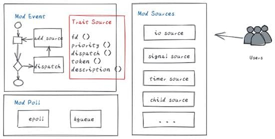

# 事件驱动模块的设计

**Keywords** **关键词**： *epoll,* *事件驱动，多路复用*

**Abstract** **摘要**：*event**事件驱动框架是一种基于epoll**多路复用的异步编程框架，包含调度主体、epoll**封装及事件类型支持等模块。*

**List of abbreviations** **缩略语清单**：

| Abbreviations缩略语 | Full   spelling 英文全名 | Chinese   explanation 中文解释 |
| ------------------- | ------------------------ | ------------------------------ |
|                     |                          |                                |
|                     |                          |                                |
|                     |                          |                                |
|                     |                          |                                |

# 1    概述

【关键内容】

伴随着sysmaster项目的推进，需要底层编程框架的支持，来方便的管理和调度异步事件，并进行相应的调度，同时方便代码开发，使开发者免于关注底层细节，直接使用封装好的事件类型来进行异步编程。

## 1.1    目的

【关键内容】

本文档主要针对event模块的功能进行设计，明确0层架构以及内部各个组件的详细设计，明确主要数据结构和主要处理过程，作为今后的编码阶段的输入和编码人员、测试人员的指导。

# 2    特性需求概述

表2：特性需求列表

| 需求编号 | 需求名称           | 特性描述                                                                                          | 优先级 |
| -------- | ------------------ | ------------------------------------------------------------------------------------------------- | ------ |
| 1        | Poll事件封装层     | 提供一个统一的poll接口层，封装对epoll等底层异步事件注册、删除、监听，可以屏蔽底层平台和架构差异。 | 高     |
| 2        | Event调度框架实现  | 提供对异步事件的注册、调度、删除，支持优先级。                                                    | 高     |
| 3        | Source事件类型支持 | 提供对常见的异步事件支持，如io、timer、signal等，方便开发者使用                                   | 高     |

# 3    需求场景分析

## 3.1    特性需求来源与价值概述

结合传统1号进程优缺点，有必要全新构建1号进程来应对未来场景。事件驱动异步编程框架作为软件底座，需要精确设计，而提供统一的框架有利于简化项目模型，加速软件开发。

## 3.2    特性场景分析

使用该特性的用户主要为开发者，开发者通过使用统一的接口，只需要注册事件的类型，及收到事件后如何处理，便能完成异步代码的开发。Event框架充当调度器角色，管理、监听及调度。

## 3.3    特性影响分析

Event编程框架屏蔽了底层平台差异，封装了细节，使用rust开发，具有高可靠性。无其他依赖，唯一交互是API。

## 3.4    友商实现方案分析

| 友商     | 特点                                                              |
| -------- | ----------------------------------------------------------------- |
| Systemd  | 以epoll为基础，实现event调度框架  C语言、不支持mac、windows等平台 |
| Upstart  | 当前无此特性                                                      |
| Sysvinit | 当前无此特性                                                      |

# 4    特性/功能实现原理

## 4.1    总体方案

 

整个特性包含三个模块，Mod Event，Mod Poll和Mod Sources。

1． Mod Poll：封装底层的epoll（unix）、kqueue（mac），向上提供统一的Poll接口。

2． Mod Event：实现一个调度框架，处理事件注册、监听和调度。同时提供Trait Source，实现了该Trait的Mod Sources都可以方便的被Event调度框架管理。

3． Mod Sources：默认提供实现了Trait Source的常见事件类型，供用户使用。

 

## 4.2    Mod Poll模块设计

Mod Poll是对底层异步IO的封装，呈现统一的struct Poll视图。

| 类及接口 |
| -------- |
|          |

通过在不同平台下，实现上图中的接口，来达到对该平台的支持。在linux下，这些接口背后是由epoll接口实现。在mac下，这些接口由kqueue实现。

上层无需关注细节，通过调用Poll提供的接口，可以方便的注册、再注册、注销事件的监听。

该Mod被Mod Event调用。

## 4.3    Mod Event模块设计

Mod Event有Event调度器和Trait Source组成。前者负责事件的管理和调度，后者负责定义能被调度器管理的行为接口。

### 4.3.1  Struct Event

| 类及接口 |
| -------- |
|          |

Struct Event实现了调度器，可以根据优先级来调度事件的处理代码。

new()方法初始化并创建一个调度器。

add_source()方法是将需要监听的事件注册到调度器中。

run()及rloop()方法执行调度器，开始监听、调度。

### 4.3.2  Trait Source

Trait Source定义了统一的行为，只有实现了这些接口的事件类型才能被Event调度器纳管。

| trait及接口 |
| ----------- |
|             |

Struct Event实现了调度器，可以根据优先级来调度事件的处理代码。

fd()给出需要监听的fd。

epoll_filter()指定要监听fd上的事件类型，如EPOLLIN、EPOLLOUT等。

priority()设置事件的优先级。

dispatch()监听到事件后，被调度器调度执行的业务代码。

## *4.4*    *Trait Sources*

 Mod Sources下包含若干实现了trait Source的事件类型，如IO，timer，signal等。用户通过直接定义或封装该对象，其实体可以被Event调度。

### 4.4.1     设计思路

各种事件类型，根据实际的用途对trait Source进行封装，如signal类型，通过创建signalfd，将所要监听的事件统一挂靠到该fd中，然后将fd注册到event中，从而实现其功能。

每一个Timer事件可以创建一个timerfd，但由于系统中的文件句柄数目有限，一种好的方案是为每种类型的时钟源创建一个timefd，然后自身设置一个调度算法来管理timer，只需少量的fd便可以完成timer事件的驱动。

其他类型的事件类型。

## 4.5    特性下的非功能需求设计

NA

# 5    可靠性/可用性/Function Safety设计

NA

# 6    安全/隐私/韧性设计

NA

# 7    特性非功能性质量属性相关设计

NA

# 8    数据结构设计（可选）

本章节完成数据库结构的设计（数据库表结构，可以使用Power Designer完成），可选章节。

# 9    词汇表

| **词汇表** |          |
| ---------- | -------- |
| **名称**   | **描述** |
|            |          |
|            |          |
|            |          |
|            |          |
|            |          |
|            |          |
|            |          |
|            |          |
|            |          |
|            |          |
|            |          |
|            |          |
|            |          |
|            |          |
|            |          |

# 10   其它说明

NA

# 11   参考资料清单

请罗列本文档所参考的有关参考文献和相关文档，格式如下：

作者＋书名（或杂志、文献、文档）＋出版社（或期号、卷号、公司文档编号）＋出版日期+起止页码

(1)  张万胜，架构与模块设计.ppt，2009
