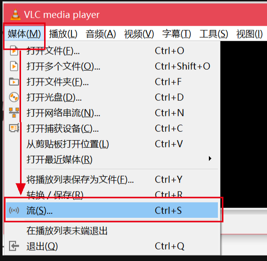
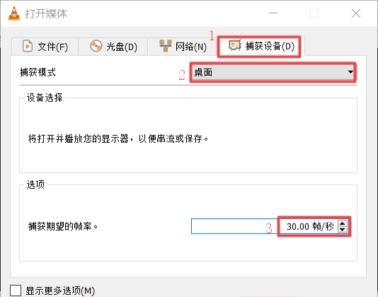
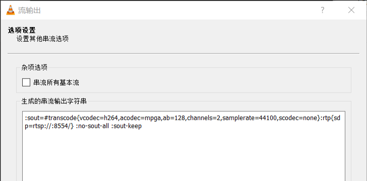
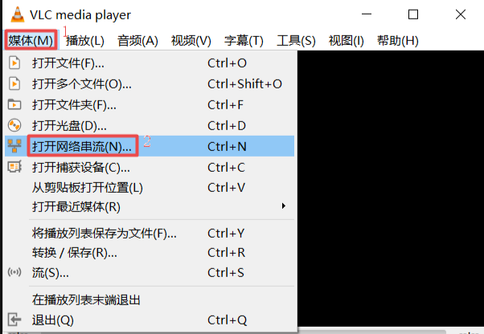
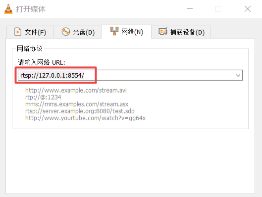
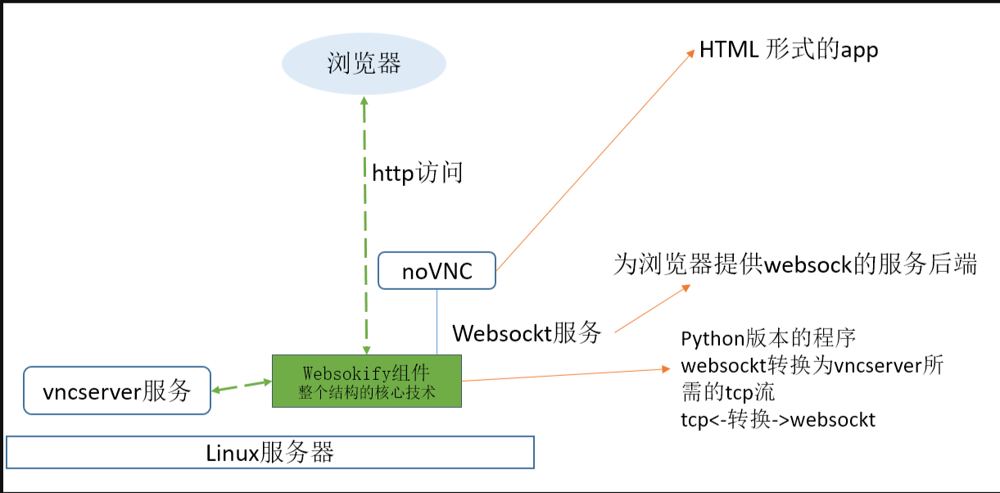

<div style="text-align: center;"><h1>调研报告</h1></div>

**选取实验：**
- 实验8：无线投屏

**小组成员：**
- 姓名：张杰 | 学号：202428016029xxx
- 姓名：高郁滔 | 学号：202428016029xxx
- 姓名：李锦源 | 学号：202428016029005

**成员分工：**
- 张杰 | 工作：（1）项目前期调研  （2）(novnc + x11 + webserver)项目代码构建
- 高郁滔 | 工作：（1）进行推流方式(VLC)性能调研及其优化尝试 （2）novnc项目前期可行性调研及部署
- 李锦源 | 工作：（1） 进行MiracleCast协议方式调研及其网卡问题解决尝试 （2）(novnc + x11 + webserver)项目后期代码整体编译过程与适用性调整

## 一、前期调研

### 1.针对MiracleCast协议的调查

#### （1）MiracleCast协议的介绍

MiracleCast是一个开源软件项目，它基于Wi-Fi显示规范（也称为Miracast）实现，旨在通过**无线方式连接外部显示器到您的系统**。这个项目允许用户无需物理HDMI连接，就能将本地内容流式传输至外部设备，或者将嵌入式设备转变为具备WiFi显示功能的外部屏幕。

MiracleCast项目主要使用C和C++进行开发，并且依赖于一系列库，例如GStreamer用于多媒体处理，以及systemd和glib等来支持系统级服务管理与事件处理。

它的核心实现包括 **显示源（Display-Source）** 和 **显示接收端（Display-Sink）** 两部分。显示源功能允许用户将外部显示器连接到系统并流式传输本地内容，而显示接收端功能则使用户能够创建自己的无线显示设备。技术层面上，MiracleCast依赖于systemd用于设备管理、dbus管理和服务管理，glib作为当前DHCP实现的实用库，gstreamer用于显示流式传输的输出，以及wpa_supplicant用于网络连接。此外，MiracleCast支持多种构建系统，包括autotools、cmake和meson，方便用户根据自己的环境选择合适的构建方式。

MiracleCast的应用场景非常广泛，尤其适合需要无线显示功能的情况，如将移动设备上的多媒体内容以高质量的方式分享到电视机等大屏幕设备上。**尽管Display-Source功能尚未完全实现，但Display-Sink功能已经非常成熟，适用于嵌入式设备和桌面系统。**

#### （2）选取项目的具体说明

MiracleCast项目需要安装以下软件：
- **systemd**:一个系统管理守护进程，用于设备管理（udev）、D-Bus管理（sd-bus）和服务管理。项目至少需要systemd版本221，这个版本可以直接使用。对于更早的版本，需要编译时启用--enable-kdbus选项。
- **glib**：一个实用工具库，当前项目在DHCP实现中使用。一旦sd-dns具备DHCP服务器功能，glib将被移除。所需版本：~=glib2-2.38（可能与旧版本兼容，未经测试）。
- **gstreamer**：MiracleCast依赖gstreamer来展示其输出。你可以通过运行res/test-viewer.sh脚本来测试是否已安装所有必需组件。
- **wpa_supplicant**：MiracleCast会启动一个带有自定义配置的wpa_supplicant。
- **P2P Wi-Fi设备**：尽管现在大多数设备都支持，但仍有一些设备不兼容Wi-Fi Direct（之前称为Wi-Fi P2P）。你可以使用res/test-hardware-capabilities.sh脚本来测试你的设备是否支持。
- **check**：C程序的测试套件，用于MiracleCast代码库的可选测试。所需版本：~=check-0.9.11（可能与旧版本兼容，未经测试）。

项目具体使用方法：

**Steps to use it as sink**：
1. 关闭wpa_supplicant 和 NetworkManager：

```
$ systemctl stop NetworkManager.service
$ systemctl stop wpa_supplicant.service 
```
2. 启动Wi-Fi守护进程：
```
$ sudo miracle-wifid &
```
3. 启动接收端控制(这里的"3"代表的是网卡)：
```
$ sudo miracle-sinkctl
[ADD]  Link: 3
```
4. 在链接上运行Wi-Fi显示：
```
> run 3
```
5. 将你的机器与其他Miracast设备配对（镜像显示）
6. 在机器上看到你的屏幕设备

**Steps to use it as peer**：

1. 重复从"Steps to use it as sink"中的步骤1和步骤2
2. 启动Wi-Fi控制
```
$ sudo miracle-wifictl
```
3. 设置对其他设备的可见性
4. 使用扫描定位其他设备
```
> p2p-scan
```
5. 其他信息参考[Q&D see Using as peer](https://github.com/albfan/miraclecast/issues/4)

#### （3）部署过程及遇到的问题

首先我们小组从github获取源码并进行编译：
```
1 安装git
sudo dnf install git
2 克隆库
git clone https://github.com/albfan/miraclecast.git
3 安装cmake
sudo dnf install cmake
4 检查systemd版本
sudo dnf info systemd
5 安装glib
sudo dnf install glib2-devel
6 安装check
sudo dnf install check
7 复制dbus策略文件
sudo cp res/org.freedesktop.miracle.conf /etc/dbus-1/system.d/
8 安装一个库
sudo dnf install readline-devel
9 编译过程：
    cd /miraclecast
    mkdir build
    cd /build
    cmake ..
    make
    sudo make install
```
我们发现项目可以正常编译并安装，我们使用发送端进行启动：
```
sudo systemctl stop NetworkManager.service
sudo systemctl stop wpa_supplicant.service
sudo miracle-wifid &
sudo miracle-wifictl
```
此时已经进入控制台，我们想要选取特定的连接：
```
> select 联接号
> p2p-scan 
// 扫描设备
```
我们运行命令之后可以正确的探测设备，但是发现**无法正确地连接设备**。

我们结合助教老师的提示信息，得到结论：**设备的部分驱动不完整，可能需要网卡厂家协助**。但是我们无法正确地定位网卡的问题，因此这个协议的链接也无法继续往前推进了。


### 2.针对以推流方式的调查
#### （1）关于推流方式的介绍

推流是一种将实时视频数据从一个源端（如摄像头、采集卡等）发送到一个或多个目标端（如服务器、云平台、移动设备等）的过程。

**下面是推流方式的一些关键点：**
1. **视频采集**：通过摄像头、采集卡等设备获取视频信号，并将其转化为数字数据。
2. **视频编码**：将采集到的视频数据进行压缩编码，减少数据量并提高传输效率。常用的视频编码标准包括H.264、H.265等。
3. **媒体传输**：通过网络将编码后的视频数据传输到目标端。传输过程中需要考虑网络带宽、延迟等因素，以保证视频数据的实时性和流畅性。
4. **视频解码**：目标端接收到视频数据后，需要进行解码操作，将压缩后的数据还原为原始的视频信号。
5. **视频播放**：解码后的视频数据可以通过播放器等工具进行播放，供用户观看。
6. **推流协议与传输**：使用特定的流媒体协议将编码后的视频数据通过网络传输到目标端。常用的流传输协议包括RTSP、RTMP、HLS等。例如，RTMP（Real-Time Messaging Protocol）是Adobe Systems开发的一种流媒体协议，广泛应用于直播领域。

**一些额外涉及的技术：**

- **CDN分发**：通过一定的Qos算法将音视频流数据推送到网络，并通过CDN进行分发，以提高直播的流畅度和稳定性。
- **Web实现推流**：Web端实现推流的方式有多种，主要包括使用WebRTC、RTMP协议、HLS协议、FLV协议等。

#### （2）具体采用的推流方式的介绍
我们小组成员考虑初步使用VLC进行跨平台的远程投屏进行可行性与性能测试。

具体的步骤如下：
**针对RISCV端需要产生视频流：**
1. 在"媒体"中选取流选项：
<div style="text-align: center">
  
</div>

2. 选择"捕获设备"，捕获模式选择"桌面"，帧率输入"30",然后选择"串流"选项即可：
<div style="text-align: center">
  
</div>

3. 选择传输协议为"RTSP"，RTSP推流端口默认为8554， 勾选"激活转码"，配置文件选择"Video - H.264 + MP3(MP4)"。这些部分比较简单按照程序指示进行即可。

4. 生成的串流输出字符串，如图所示。在调用VLC库进行编程方式实现推流时可参考该字符串。此时我们点击"流"的话，立马就会开始推流。

<div style="text-align: center">
  
</div>

**针对接收端需要拉取视频流：**
1. 打开VLC播放器，选择"媒体",然后"打开网络串流":

<div style="text-align: center">
  
</div>

2. 选取RISCV设备的IP，端口默认为8554。我们输入rtsp://[xxx.xxx.xxx.xxx]:8554/，如下：

<div style="text-align: center">
  
</div>

3. 点击播放即可完成推流

#### （3）推流方式的问题
我们组依据如上所示的步骤进行操作之后，我们发现我们的远程屏幕**可以成功完成投屏功能**，并且具有**理想的分辨率与帧率**，但是发生了**严重的卡顿与较大的时间延迟**。具体来说时间延迟**远大于1s**，同时必须**借助VLC客户端进行拉流**才能播放视频。

我们组为了优化所选推流方式的性能进行了以下尝试：

- 改用**UDP协议**进行传输：仍然具有较大的延迟
- 改用**FFmpeg工具**进行推流与拉流：仍然具有较大的延迟
- 测试网络性能是否影响延迟，实践发现**网络性能不是导致延迟**的关键因素
- 考察CPU占用率，发现在推流期间**CPU占用率**较高，可能是导致**较大延迟**的原因

## 二、实验前置环境说明

### 1.针对noVNC项目的说明

#### （1）整体说明


**总体描述：** noVNC 是一个 HTML VNC 客户端的 JavaScript 库，同时也是基于该库构建的应用程序。noVNC 在任何现代浏览器中运行良好，包括移动浏览器（iOS 和 Android）。许多公司、项目和产品已经集成了 noVNC，包括 OpenStack、OpenNebula、LibVNCServer 和 ThinLinc。

**项目工作流程示意图：**

<div style="text-align: center">
  
</div>

项目**主要特征**描述如下：

- **远程桌面访问：** noVNC允许用户通过现代浏览器远程访问主机，无需安装任何额外的软件或插件。这使得用户可以在任何地方、任何设备上通过互联网访问远程计算机的桌面
- **跨平台兼容性：** noVNC支持所有现代浏览器，包括移动设备上的浏览器（iOS和Android），打破了操作系统的限制
- **用户友好界面：** noVNC提供了清晰的用户界面和良好的用户体验
- **便捷部署与整合：** 提供快速启动脚本和通过Snap包安装的选项，易于集成到现有的IT架构中


**项目对浏览器的需求：**
noVNC 使用了许多现代网络技术，因此没有正式的要求列表。以下是我们目前所知道的**浏览器最低版本** 要求：Chrome 89，Firefox 89，Safari 15，Opera 75，Edge 89


**项目对服务器的要求：**
noVNC 遵循标准的 VNC 协议，但与其他 VNC 客户端不同，它需要 **WebSockets** 支持。许多服务器已经**内置了这种支持** （例如 x11vnc/libvncserver、QEMU 和 MobileVNC），但对于其他没有内置 WebSockets 支持的服务器，你需要使用一个 WebSockets 到 TCP 套接字的代理。noVNC 有一个姊妹项目 websockify，它提供了一个简单的此类代理。

**快速部署的方法：**
使用 novnc_proxy 脚本自动下载并启动 websockify，它包括一个迷你网络服务器和 WebSockets 代理。使用 --vnc 选项来指定正在运行的 VNC 服务器的位置：
```
./utils/novnc_proxy --vnc localhost:5901
```
如果你不需要将网络服务器暴露给公共互联网，你可以将其绑定到本地主机：
```
./utils/novnc_proxy --vnc localhost:5901 --listen localhost:6081
```
将你的浏览器指向 novnc_proxy 脚本输出的剪贴板 URL。点击连接按钮，如果 VNC 服务器配置了密码，则输入密码开始享受远程桌面访问。

#### （2）noVNC 项目核心代码

- **WebSockets 代理（websockify）：**
noVNC 需要 WebSockets 支持来与 VNC 服务器通信，而许多 VNC 服务器并不直接支持 WebSockets。因此noVNC 使用其姊妹项目 websockify 来作为 WebSockets 到 TCP 套接字的代理。websockify 的核心代码负责将 WebSocket 流量转换为普通的 TCP 流量，以便 VNC 服务器能够处理。

- **VNC 客户端库：**
noVNC 本身是一个 HTML VNC 客户端 JavaScript 库，它允许用户通过浏览器访问 VNC 服务器。核心代码包括 VNC 协议的实现以及屏幕更新。

- **安全性：**
noVNC 支持通过 SSL/TLS 协议加密连接，有效防止了数据在传输过程中的泄露风险
。此外，noVNC 还支持多种认证方式，如 classical VNC、RealVNC's RSA-AES、Tight、VeNCrypt Plain 等。

- **性能优化：**
为了确保 noVNC 在各种使用场景下都能保持高效稳定的运行状态，采取合理的性能优化策略显得尤为关键。通过对图像数据的压缩处理，可以显著减少数据传输量，从而加快响应速度。

- **项目目录结构及介绍：**
noVNC 项目的目录结构包括 app/、core/、docs/、po/、snap/、tests/、utils/、vendor/ 等，其中 **app/** 包含**应用程序** 的核心代码，**core/** 包含**核心库代码** 。

- **项目配置文件介绍：**
noVNC 项目的**配置文件主要包括**  defaults.json 和 mandatory.json，其中 defaults.json 包含了 noVNC 的默认配置选项，而 mandatory.json 包含了 noVNC 客户端运行所必需的配置选项。

### 2.针对 websockify 项目的说明

#### （1）整体说明

websockify 是 noVNC 项目的一部分。在最基本的层面上，websockify 只是将 WebSockets 流量转换为普通的套接字流量。websockify 接受 WebSockets 握手，解析它然后开始在客户端和目标之间**双向转发流量。**

**websockify 的附加特性:**
- **守护进程化：** 当指定 -D 选项时，websockify 会在后台作为守护进程运行。
- **SSL（wss:// WebSockets URI）：** websockify 通过嗅探客户端发送的第一个字节自动检测 SSL。如果数据以 '\x16' 或 '\x80' 开头（表示 SSL），则包装套接字。
- **令牌插件：** 一个 websockify 实例可以根据客户端发送的令牌（使用令牌 URL 参数）或用于访问 websockify 的主机名（如果你使用 --host-token）连接客户端到多个不同的预配置目标。这个功能通过 --token-plugin CLASS 和 --token-source ARG 选项激活，其中 CLASS 通常是 token_plugins.py 中的一个，ARG 是插件的配置。
- **迷你网络服务器：** websockify 可以检测并对同一端口上的普通网络请求做出响应，就像 WebSockets 代理一样。这个功能通过 --web DIR 选项激活，其中 DIR 是要服务的网络目录的根目录。

**按照以下步骤安装 websockify：**
- **下载：**
下载 websockify 的一个发行版本或最新的开发版本。

- **解压：**
将下载的文件解压到一个目录。

- **安装：**
以 root 用户身份在包含解压文件的目录中运行 `python3 setup.py install` 命令。通常情况下，如果没有安装 numpy，这个过程还会自动安装 numpy 以获得更好的性能。numpy 是可选的。

- **编辑 `setup.py`（如果需要）：**
如果你不想安装 numpy 或者无法编译它，可以在运行 `python3 setup.py install` 之前编辑 `setup.py` 文件，移除 `install_requires=['numpy']`, 这一行。

- **确认安装：**
安装完成后，websockify 应该已经添加到了你的路径中。运行 websockify --help 来确认它是否正确安装。

#### （2）websockify项目核心代码:
- **技术亮点：**
HyBi/IETF 6455协议支持：自版本 0.5.0 起，websockify 仅支持最新且高效的 Hybi/WebSocket 标准。加密连接（wss://）：支持 WebSocket 加密传输，需自定义证书配置。这涉及自签名证书的创建与信任机制的建立，在安全性上达到了行业标准要求。

- **项目目录结构：**

  - websockify/：项目根目录。
  - COPYING：许可证文件。
  - `README.md`：项目 README 文件，包含项目简介和使用指南。
  - src/：源代码目录，包含 `websockify.py` 主要的 WebSocket 到 TCP 代理脚本。
  - contrib/：包含社区贡献的辅助工具，如 Docker 配置文件。

- **启动文件：**
主要的启动文件是位于 `src/websockify.py`。这是一个 Python 脚本，可以作为 WebSocket 到 TCP 代理服务器使用。

- **配置和命令行参数：**
websockify 可以通过命令行参数来调整行为，如设置 WebSocket 监听的端口号、启用 SSL、记录数据流到文件等。

### 3.针对 x11vnc 环境的说明


#### （1）整体说明
x11vnc 是一个 VNC 服务器，它允许用户远程查看和控制真实的 X11 显示（即与物理显示器、键盘和鼠标相连的显示）。x11vnc 可以被看作是 Unix/X11 系统上的 WinVNC。它支持多种功能，包括 SSL/TLS 加密、RSA 认证、UNIX 账户和密码登录、服务器端缩放、单端口 HTTPS/HTTP+VNC、Zeroconf 服务广告、TightVNC 和 UltraVNC 文件传输等。

**x11vnc 的附加特性：**
- **加密终端服务模式：** 基于 Unix 用户名和密码，用户无需记忆自己的 VNC 显示/端口号。
- **多平台支持：** 支持 Mac OS X、网络摄像头、电视卡捕获设备和嵌入式 Linux 系统。
- **IPv6 支持：** 提供完整的 IPv6 支持。

**按照以下步骤安装 x11vnc：**
1. **下载：** 从 LibVNC 的 GitHub 仓库或 SourceForge 项目页面下载 x11vnc 的发行版本或最新的开发版本。
2. **解压：** 将下载的文件解压到一个目录。
3. **安装：** 通常，可以通过包管理器安装 x11vnc，如在 Debian 系统上使用 `apt-get install x11vnc`。或者，从源代码编译安装。
4. **编译源代码（如果需要）：** 在包含解压文件的目录中运行 `./configure` 和 `make` 命令来编译和安装 x11vnc。
5. **确认安装：** 安装完成后，运行 `x11vnc --help` 来确认它是否正确安装。

#### （2）x11vnc 项目核心代码：
- **技术亮点：**
  - **X11 显示捕获：** x11vnc 使用 XShmGetImage() 持续轮询 X11 帧缓冲区以检测变化。
  - **高效压缩：** 利用 libvncserver 压缩变化并发送给连接的 VNC 查看器。
  - **安全特性：** 支持 SSL/TLS 加密和 RSA 认证。

- **项目目录结构：**
  - `x11vnc/`：项目根目录。
  - `COPYING`：许可证文件。
  - `README.md`：项目 README 文件，包含项目简介和使用指南。
  - `src/`：源代码目录，包含主要的 x11vnc 源文件。
  - `contrib/`：包含社区贡献的辅助工具和脚本。

- **启动文件：**
主要的启动文件是 `src/x11vnc`。这是一个程序，可以作为 VNC 服务器使用，连接到 X11 显示并允许远程访问。

- **配置和命令行参数：**
x11vnc 可以通过命令行参数来调整行为，如设置 VNC 监听的端口号、启用 SSL、指定密码文件等。

